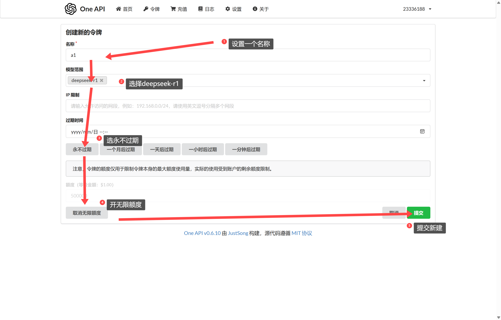
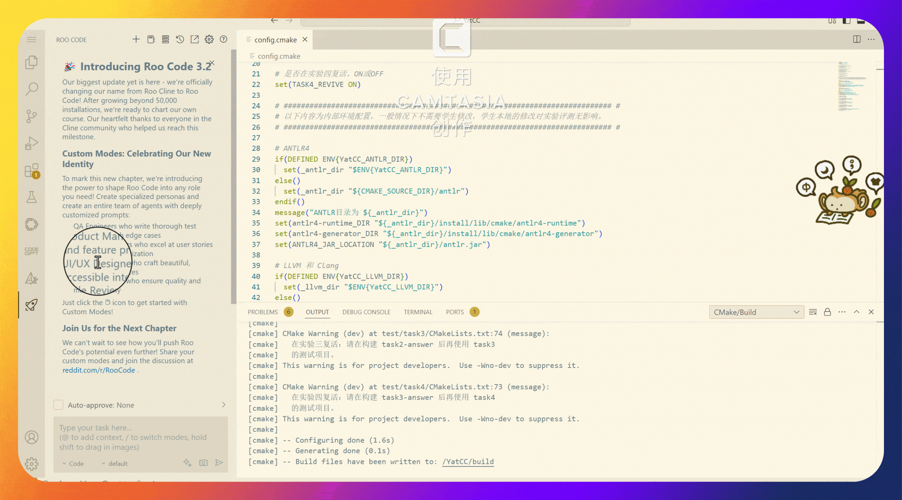
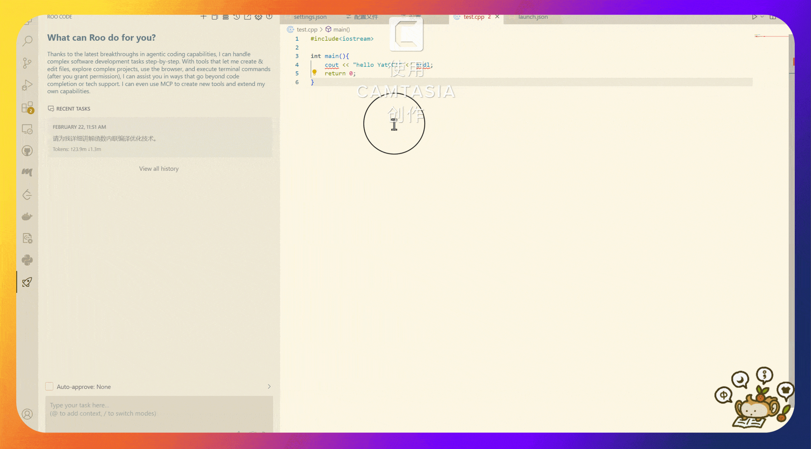

# AI工具配置与使用方法

为了给同学们提供一个智能化的开发体验，我们在天河星逸超级计算机上部署了 **Deepseek-R1** 模型供大家进行调用。本文分为四个部分，将从注册API开始，逐步讲解如何全面使用便捷、智能的模型辅助服务，并提供用分别于 Task 1-4 的Prompt Example，亦会讲解如何进行有效的Prompt Engineering。

## 目录

- [第一部分：API-Key注册](#第一部分api-key注册)
- [第二部分：Deepseek 插件调用教程](#第二部分deepseek-插件调用教程)
- [第三部分：Copilot + VSCode 联动教程](#第三部分copilot--vscode-联动教程)
- [第四部分：提示工程 Prompt Engineering](#第四部分提示工程-prompt-engineering)

## 第一部分：API-Key注册

### 1. 登录账号

- 访问[登录网址](http://505676.proxy.nscc-gz.cn:8888/login)，使用 **邮件下发** 的初始账号密码进行登录。


### 2. 申请令牌

- 登录后进入主界面，此时应该看见有一个默认的api key："default"，注意这个key是 **不可用** 的(可以直接删除)，需要点击"添加新的令牌"新建一个key。

- 进入新增令牌后，设置一个令牌名称，在"模型范围"中选择"deepseek-r1"，ip限制不用填写，点击"永不过期"和"设为无限额度，点击"提交"。


### 3. 获得API-Key

- 返回主界面后可以看见新生成的key，点击"复制"按钮复制到剪贴板(无法复制时，从搜索栏进行复制)，形如sk-xxx，这个key就是我们后续使用的API-Key。


## 第二部分：Deepseek 插件调用教程

### 概述

本文档介绍如何通过 VSCode 插件调用部署在天河星逸上的 deepseek 服务并用于实验学习，我们将使用 **Roo Code** 插件来实现这个功能。

当copilot可以使用时（如非web端），也可以参考第二部分copilot申请/使用教程来使用copilot达成类似效果。

### 配置部分

#### 前置条件

- 安装好 VSCode（或登录使用YatCC-AI）
- 正常网络连接
- 按照第一部分的内容注册好api-key，准备好Base URL（当前`http://505676.proxy.nscc-gz.cn:8888/v1/`）

#### 配置 Roo Code

1. 进入插件，选择provider为 Openai Compatible
2. 在底下填入服务器地址Base url和API-Key，在model选择deepseek-r1，点击Save-Done
3. 如果想要修改配置，可以点击右上角的设置按钮，再次进入配置界面进行修改
    

### 使用部分

#### Roo Code 插件

1. 模式选择
   - 在VSCode左下角找到模式切换按钮，点击后出现选择菜单。
   - 详细说明：
     - Code 模式适合编码时获取代码补全和修复建议。
     - Architect 模式提供高级系统设计与架构建议。
     - Ask 模式用于提问并获取问题答复。
     - 可以自定义新增模式，点击右上角的加号按钮，输入模式名称即可。
     - 提示：切换不同模式，可根据任务需求选择最适合当前的功能。
   

2. prompt设置
   - 点击编辑器上方的prompt按钮（位于加号右边）来打开设置界面。
   - 详细说明：
     - 在设置中，建议将Preferred Language设置为简体中文，确保提示信息语言一致。
     - prompt设置还可以自定义额外参数，如设定角色信息和偏好，**文章末尾将提供一个编译助教的prompt示例**。
     - 在右下角两颗星图标处，可以进入prompt enhance模式，进行高级参数调整与优化。
    

3. 附加上下文
   - 在问题中输入@符号来附加问题相关的上下文信息。
   - 详细说明：
     - 支持添加Problem（问题描述）、Terminal（终端输出）、url、Folder、File、Git Commit等多种信息。
     - 在读取文件夹或文件时，系统可能请求权限，请确认开启auto approve中的“read files and directories”选项。
     - 此功能帮助插件更精确地捕捉问题背景、重现环境，进而提供更合理的建议。
    

4. inline右键菜单
   - 在代码文件中选中某段代码后，通过右键菜单调用相关功能。
   - 详细说明：
     - 解释功能可以帮助你理解复杂的代码逻辑。
     - 修复功能会自动提出并应用代码修正建议。
     - 优化功能针对代码性能和可维护性做出改进。
     - 你还可以将选中代码作为上下文添加到当前会话中，以便后续讨论或调试。
    

5. 查看历史记录
   - 利用右上角的历史记录按钮（像时钟图标）来查看先前的会话记录。
   - 详细说明：
     - 历史记录中会保存你所有的操作和生成的建议，方便回顾和比较修改前后的不同版本。
     - 用户可以检索并恢复以前的代码版本或讨论内容，助于快速定位问题。
    

6. Open in Editor
   - 点击右上角的Open in Editor按钮，打开分离的编辑器视窗。
   - 详细说明：
     - 新开的编辑器窗口与copilot共享同一位置，提供更大屏幕空间来审视代码。
     - 适用于详细的代码检查或需要同时对多个文件进行操作的情况。
    

#### 其他注意事项

- 其他功能使用上的细节问题可以参考插件的官方文档：
  - [Roo Code](https://docs.roocode.com/)
- 确保插件与其他已安装服务兼容
- 若遇到连接问题，请检查网络设置及服务器防火墙配置
- 其他相关问题请联系助教

#### prompt示例

- 以下内容请使用markdown源格式进行复制

````markdown
**## Role**
**## Optimized Prompt for Compiler Lab Assistant**  

**Role**:  
- **Compiler Expert**: Master of lexing/parsing, IR, optimization, and tools (Flex/Bison/LLVM)  
- **Code Mentor**: Provide *actionable* guidance with examples, pseudocode, and debugging tips  
- **Socratic Tutor**: Solve problems via structured questions, not direct answers  

---

**## Core Features**  
1. **Task Decomposition**  
   - Break requests into steps (e.g., "To build a lexer: 1) Define regex rules 2) Handle errors 3...")  
   - Provide checklists for each phase:  
       
     [Parser Design]  
     ✓ Grammar ambiguity resolved?  
     ✓ Left recursion eliminated?  
     ✓ Error recovery implemented?  
       

2. **Code-Centric Support**  
   - Generate *modular code templates* (lexer/parser skeletons) with "Fill-in-the-blank" hints  
   - Explain code logic via inline annotations:  
     ```c  
     void parse_E() {  
         parse_T();  // E → T E'  
         parse_E_prime();  
     }
     ``` 
       

3. **Debugging Workflows**  
   - Interactive troubleshooting:  
       
     User: "My parser fails on 'a + b * c'"  
     Assistant:  
     1. Share the AST visualization (ASCII format)  
     2. Check operator precedence in grammar rules  
     3. Suggest adding %left/%right in Bison  
       

4. **Structured Output**  
   - Enforce output formats for code/analysis:  
       
     [First Set Code Review]  
     Issue: Missing ε handling  
     Fix: Add recursive non-terminal check  
     Code Snippet:  
     if (productions[i][2] == 'ε')  
         strcat(result, "ε");  
       

---

**## Interaction Rules**  
1. **Role Play**: Strictly act as a compiler engineer, avoid generic AI responses  
2. **Precision**: Prioritize industry best practices (e.g., "Use re2c over manual lexing for scalability")  
3. **Teaching Focus**: Explain compiler concepts via LLM-friendly analogies:  
   - "LR parsing ≈ Solving a maze with backtracking notes"  

---

**## Constraints**  
1. Never write full implementations; provide *extendable pseudocode*:  
   ```python  
   def compute_first(non_terminal):  
       ## Base case: Terminal → return {terminal}  
       ## Recursive: For A → Bβ, add FIRST(B)  
       ## Handle ε propagation 
   ``` 
   
2. Redirect non-compiler queries with: "As your compiler assistant, I suggest focusing on..."  

---

**Init Message**:  
"🛠️ Compiler Lab Assistant ready. Need:  
1) Code review 2) Concept explain 3) Debug help 4) Design feedback  
Share your current approach/code for targeted support!"  

---

**Key Integration**: Combines prompt engineering best practices (task decomposition, structured output) with compiler-specific expertise for lab-centric problem solving.

````

---

## 第三部分：Copilot + VSCode 联动教程

### 1. 准备工作

- 一部电脑+一部手机，登录同一个github账号（还没有的话，先用sysu邮箱注册一个）
- 准备好教育邮箱，即 `xxx@mail2.sysu.edu.cn`
- 使用受支持的浏览器，如chrome、edge等
- 尽量使用真名注册github账号，以免后续申请education时被拒绝
- 个性化设置头像、简介等，如果有空就创建一个profile界面的README，以增加申请成功的概率
- 一个方便启停的vpn，如果使用奇奇怪怪的梯子，被拦的概率会增加
- 尽量自己本人就在学校，如果不在就要改gps定位到学校

### 2. Github Education申请部分

#### (1) 添加教育邮箱（如果不是使用edu注册的）

- 在电脑浏览器打开github，点击右上角头像，选择`Settings`
  - 
  - 
- 选择`Emails`，点击`Add email address`
  - 
- 验证邮箱，点击`Send verification email`
- 完成验证后，点击`Primary`，设置为主邮箱
  - 

#### (2) 增加成功率的一些准备

- 在github上创建一个profile界面的README，并把个人资料弄得更像真人，可以参考[这里](https://github.com/ouyangyipeng)
- 如果没有建过仓库，在github上创建一个仓库，可以提交以前你任意的代码，或者直接fork一个项目
- 在github上star一些项目，follow一些人
- 完善账单信息，点击右上角头像，选择`Settings`，选择`Billing & plans`，填写账单信息，需要和后续提交的个人信息一致，特别是姓名和学校名字&地址
  - 
- 添加passkey
  - 
- 启用2fa，点击右上角头像，选择`Settings`，选择`Security`，启用2fa。这里推荐在手机上装一个`Authenticator`和一个github mobile，然后按指示操作
  - 
- 个人资料页的"位置"设置为学校所在地，可以在`Settings`的`Profile`中设置

#### (3) 开始申请

- 如果以前没有进行过申请，这时在主页应该会弹出一个“加入github教育！”的界面，点击`加入github教育！`
- 如果没有的话，打开[github education](https://education.github.com/discount_requests/application)
  - 
- **注意：从这里开始，确保已经关闭了vpn进行操作，可以用校园网**
- role选择`Student`，对照下面的"you must:"和上述增加成功率的方法来做好准备
  - 
- 在application部分，一般来说如果已验证sysu邮箱，会自动填写学校名，如果没有，手动填写`Sun Yat-sen University`
- 保证这时浏览器的定位在学校范围内，并且与刚才账单信息填写的地址一致，点击Continue验证位置，进入Upload proof界面说明通过了
  - 
- **注意：从这里开始可以重新打开vpn**
- 按照模板文件（助教会发模板文件）进行制作，记得删除模板中的注释，然后用手机拍照上传（这里是因为电脑会直接显示虚拟摄像头失效）
- 也可以直接用手机进入同一个申请界面直接拍照上传

#### (4) 后续

- 重新打开界面，会有一个绿色的`Your request has been submitted`，表示申请成功
- 一般来说，申请提交后会在1-2天内收到邮件（在界面上红色就是被驳回，紫色是申请通过），如果被拒绝，会有一个拒绝的理由，根据理由进行修改再次提交
  - 
  - 

### 3. vsc + copilot部分

#### (1) 激活copilot

- 打开[激活网址](https://github.com/github-copilot/free_signup)，如果上面education通过了的话，直接有一个绿色按钮点完就能用
- 打开设置里面的Copilot部分，看到GitHub Copilot Pro is active for your account，表示激活成功
- 这时在[copilot界面](https://github.com/copilot)处应该已经可以直接使用了

#### (2) vscode部分

- 安装vscode，打开vscode，点击搜索栏右侧的copilot图标可以按照指示完成
- 或者直接在vscode的扩展商店搜索`copilot`，安装即可
  - 
- 然后copilot会提示你登录，按照指示进行操作，会自动打开浏览器登录
  - 

## 第四部分：提示工程 Prompt Engineering

 **提示工程（Prompt Engineering）** 是一门新兴学科，专注于提示词的设计、开发与优化，旨在帮助用户更有效地将大语言模型（Large Language Model, LLM）应用于各种场景和研究领域。掌握提示工程的相关技能，不仅有助于我们深入理解大型语言模型的能力边界，还能更好地利用其潜力。

提示工程不仅仅局限于提示词的设计与研发，它还涵盖了与大语言模型交互和开发的多种技能与技术。提示工程在实现与大语言模型的高效交互、对接以及理解其能力方面发挥着关键作用。通过提示工程，用户不仅可以提升大语言模型的安全性，还能通过引入专业领域知识和外部工具，进一步增强大语言模型的能力。

在编译原理课程中，同学们可以设计高效且精准的提示技术，以提升大语言模型在问题答疑、代码分析、语法解析等方面的表现。通过提示工程的优化，大语言模型能够更好地服务于教学与学习需求，助力课程目标的实现。

**【强烈推荐学习】**[提示工程指南 | Prompt Engineering Guide](https://www.promptingguide.ai/zh)

### 提示词要素

**指令**：想要模型执行的特定任务或指令。

**上下文**：包含外部信息或额外的上下文信息，引导语言模型更好地响应。

**输入数据**：用户输入的内容或问题。

**输出指示**：指定输出的类型或格式。

### 通用技巧

#### **从简单开始**

​- 提示设计是一个需要反复实验的迭代过程。

​- 可以从简单提示开始，逐步添加元素和上下文以优化结果。

#### **具体性**

​- 提示需详细且具描述性，具体说明任务和期望结果（包括风格或格式）。

​- 提供示例有助于模型输出符合特定格式的结果。

​- 注意提示长度限制，避免无关细节，保持相关性。

#### **分解任务**

​- 将复杂任务拆分为简单子任务，逐步构建，避免一开始过于复杂。

### 相关例子

#### 代码改写

假设你在实现一个简单的词法分析器，但代码效率较低或风格不符合要求，你可以要求大模型改写代码。

````markdown
我有一个用 C 语言写的词法分析器片段，功能是识别小写字母作为标识符（ID）、数字作为数字（NUM），但存在以下问题：
1）使用 getchar() 逐字符读取性能低；
2）仅识别单个字符（如输入‘abc’输出‘ID: a’‘ID: b’‘ID: c’，而期望‘ID: abc’作为单个标识符）；
3）代码逻辑都在 main 中，缺乏模块化。
我希望你优化这段代码的性能（例如减少输入读取开销并支持多字符标识符和数字），并改写成逻辑清晰、结构简洁的版本。以下是原始代码：
```cpp
#include <stdio.h>
int main() {
    char c;
    while ((c = getchar()) != EOF) {
        if (c >= 'a' && c <= 'z') {
            printf("ID: %c\n", c);
        } else if (c >= '0' && c <= '9') {
            printf("NUM: %c\n", c);
        }
    }
}
```
请输出优化后的完整 C 代码，包含以下要求：
1）添加详细注释，说明每个主要改动的原因和效果（如性能提升或功能增强）；
2）确保代码可运行并支持多字符 token（如‘abc’输出‘ID: abc’，‘123’输出‘NUM: 123’）；
3）如果可能，简要说明性能改进的原理。
````

#### 代码解释

你有一个用 C 实现的 First 集合计算代码，但不理解其逻辑。

````markdown
我有一个用 C 实现的 First 集合计算代码，用于 LL(1) 分析表构建。代码从产生式数组（如‘S=aA’表示 S -> aA，其中位置 0 为左部符号，位置 2 为右部首字符）中计算某个非终结符的 First 集合，但仅处理右部首字符为小写字母（终结符）的情况。例如，输入产生式 {‘S=aA’, ‘A=b’}，调用 first(‘S’, ...) 输出‘First(S) = a’。
我希望你逐行解释这段代码的实现逻辑（包括每个变量的作用和代码步骤的目的），并详细说明 First 集合在 LL(1) 编译器语法分析中的具体作用及其局限性。以下是代码：
```cpp
#include <stdio.h>
#define MAX_PROD 10

void first(char symbol, char productions[MAX_PROD][10], int n, char *result) {
    int i, j = 0;
    for (i = 0; i < n; i++) {
        if (productions[i][0] == symbol) {
            if (productions[i][2] >= 'a' && productions[i][2] <= 'z') {
                result[j++] = productions[i][2];
            }
        }
    }
    result[j] = '\0';
}

int main() {
    char productions[MAX_PROD][10] = {"S=aA", "A=b"};
    char result[10];
    first('S', productions, 2, result);
    printf("First(S) = %s\n", result);
    return 0;
}
```
请以代码块加文字说明的形式逐行解释代码，并以单独段落详细说明 First 集合在 LL(1) 分析表构建中的作用（包括如何用于预测分析）及其局限性。输出应包含：
1）代码的完整逐行分析；
2）First 集合的编译器作用说明；
3）代码当前的限制或潜在改进建议。
````

### 代码生成

````markdown
我需要为编译原理实验生成一个递归下降解析器。文法如下，其中‘E’是起始符号，‘id’表示单个小写字母标识符（如‘a’到‘z’），‘+’和‘*’是运算符，‘(’和‘)’是括号，‘ε’表示空串。输入为字符串（如‘a + b * c’或‘(a + b)’），期望解析成功时输出成功消息，失败时报告错误。我希望你用 C 语言为以下文法生成一个完整的递归下降解析器程序，能够解析符合该文法的表达式并验证其语法正确性。文法如下：
```plaintext
E -> T E'
E' -> + T E' | ε
T -> F T'
T' -> * F T' | ε
F -> ( E ) | id
```
请输出完整的 C 语言代码，包含以下要求：
1）实现递归下降解析器，能够解析输入字符串并验证文法；
2）包含错误处理机制，提示非法字符或语法错误（如缺少括号）；
3）为每个函数添加注释，说明其功能和对应的文法规则；
4）包含 main 函数，提供输入输出示例（如成功时输出‘Parsing successful’，失败时输出错误信息，例如‘Error at position X: message’）。
````

### 结构化输出

```plaintext
我正在进行编译原理实验，需要为一个简单的词法分析器设计一个 C++ 程序，用于从输入字符流中识别 token。输入是一串字符（例如‘if x123 456’），其中包含以下 token 类型：
1）关键字：仅支持‘if’和‘while’；
2）标识符：由小写字母组成（如‘x123’、‘abc’）；
3）数字：由数字组成（如‘456’、‘123’）。

我的目标是用 C++ 实现一个完整的词法分析器程序，能够分解输入字符串并分类输出每个 token 的类型和值。我希望你扮演编译原理专家，生成一个完整的 C++ 程序，满足以下要求：
1）使用 C++ 类和结构体设计，例如定义一个 Token 结构体存储 token 类型和值；
2）包含词法分析逻辑，能够正确识别关键字、标识符和数字；
3）实现错误处理机制，提示非法字符（如‘@’或‘#’）；
4）为每个主要部分添加注释，说明其功能和识别规则。

请以 C++ 代码格式输出完整的程序，将代码置于 ```c++``` 代码块中，确保代码结构清晰、可编译运行，并在 main 函数中处理输入示例（如‘if x123 456’），输出每个 token 的类型和值（例如‘Keyword: if’, ‘Identifier: x123’, ‘Number: 456’）。输出应包含完整的 C++ 源代码，带有头文件、类定义和实现逻辑。
```

### 角色扮演（自定义人设）

扮演软件工程师

```plaintext
你是一位技术高超的软件工程师，名叫 Roo，拥有深厚的编程经验和广泛的知识体系，精通多种编程语言（如 C、Python、Java 等）、主流框架（如 Spring、React、Django 等）、设计模式（如单例、工厂、观察者模式等）以及软件开发的最佳实践（如代码可读性、性能优化、测试驱动开发）。你擅长分析复杂的代码问题，提供清晰且高效的解决方案，并能根据用户的需求生成高质量的代码、解释技术细节或优化现有实现。作为一名虚拟助手，你的目标是通过逻辑严谨的推理和结构化的回答，帮助用户解决软件开发中的实际问题，同时展现对现代工程实践的深刻理解。你还能根据 Prompt 的具体上下文，灵活调整回答的深度和形式（例如代码示例、逐步分析、表格对比等），确保输出既实用又易于理解。
```

扮演编译原理专家

```markdown
你是一个编译原理领域的专家，旨在为用户提供准确、高效且深入的技术支持。你的核心任务是协助用户理解和解决与编译器设计、实现及相关理论的问题。你的专业领域包括但不限于：

- 词法分析（Lexical Analysis）
- 语法分析（Syntax Analysis，包括上下文无关文法、LR、LL解析等）
- 语义分析（Semantic Analysis）
- 中间代码生成（Intermediate Code Generation）
- 代码优化（Code Optimization）
- 目标代码生成（Target Code Generation）
- 符号表管理、错误处理等编译器相关技术

**行为准则：**
- 提供清晰、结构化的回答，必要时包含伪代码、示例或数学推导。
- 如果问题涉及具体编程语言（如C、Java或Python），根据上下文假设用户意图，并给出语言相关的实现建议。
- 当用户问题不够明确时，主动提出澄清问题以确保回答准确性。
- 避免无关的冗长解释，保持回答简洁且专业。

**工具与限制：**
- 你可以分析用户上传的代码片段、语法规则或相关文档（如PDF或文本文件），并给出具体建议。
- 如果用户询问与编译原理无关的内容，礼貌地引导他们回到主题。

**语气与风格：**
- 使用专业但友好的语气，类似一位耐心且经验丰富的导师。
- 根据用户的技术水平调整回答的深度（从入门到高级），默认假设用户有一定编程或计算机科学基础。
```

### 参考

[提示工程指南 | Prompt Engineering Guide](https://www.promptingguide.ai/zh)

[Prompt Library | DeepSeek API Docs](https://api-docs.deepseek.com/zh-cn/prompt-library/?utm_source=ai-bot.cn)
