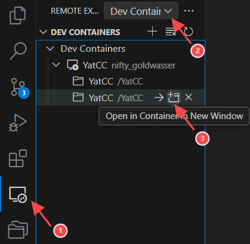
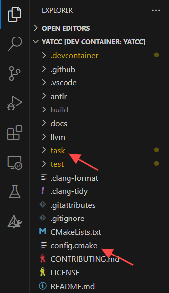
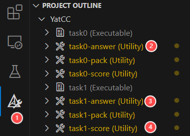
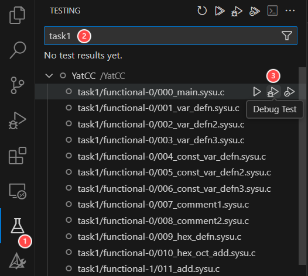
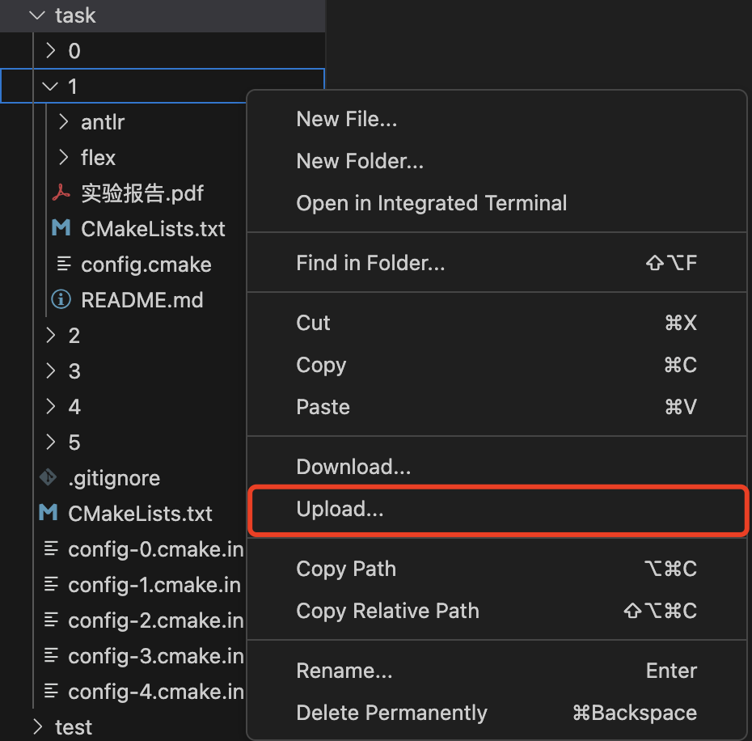
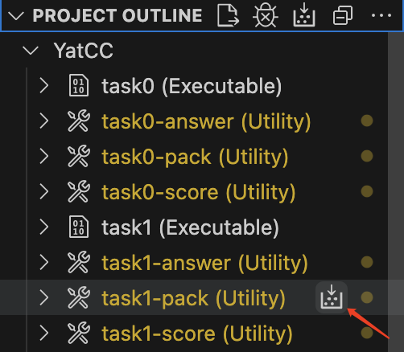

# 实验框架使用方法

在前面环境搭建的文档中我们提到了如果同学们使用我们提供的在线代码仓库或 VSCode + Dev Containers 对实验项目进行构造，同学们将体会到使用助教提前编辑好的脚本的便利，在本节中我们将对如何使用我们的实验框架进行详细的介绍。

## 如何打开项目

> 此操作面向使用 Dev Containers 完成实验的同学，使用其他方式配置环境的同学无需进行。

在上一节中我们带领同学们们完成了实验环境的配置。如果同学们在环境配置结束后对 VSCode 进行了关闭，可能会遇到不知道如何再次进入我们已经配好的环境的情况，所以在这一小节中我们将向同学们介绍如何在 VSCode 中打开我们的项目。

在上一小节环境构造时，不管同学们采用的是 `Dev Containers` 自动构建的方法还是手动构建的方法，打开项目的方式都是一样的。同学们首先需要点击下图中左侧箭头所示的像一台电脑一样的按钮 `Remote Explorer`（一个 VSCode 插件，需手动安装） 。后续步骤如下：

1. 点击`REMOTE EXPLORER`后的选择框
2. 按下向下的类三角形按钮，选择红色箭头所示的`Dev Containers`选项，之后同学们便会在下图所示的界面
3. 将鼠标放到 `YatCC`（如果是手动配置的环境，容器名称可能不同）的位置，点击鼠标右键，再点击`Open Container in Current/New Window`，即可成功打开我们的实验项目环境



## 如何更新项目

由于我们的代码仍处于不断更新与完善的阶段，同学们在实验发布或更新时需要重新拉取位于 Github 上的代码。若当前仓库使用通过`Download ZIP`直接下载源代码，此时`/path/to/YatCC`目录下不包含`.git`文件夹，此时我们需要使用以下代码跟踪远端代码仓库并拉取代码：

```shell
git init
git branch -m main
git remote add origin https://ghfast.top/https://github.com/arcsysu/YatCC.git
```

完成上述操作后，YatCC 目录下会出现`.git`文件夹，说明当前项目已关联远端代码仓库。若当前目录已包含`.git`文件夹，则执行`git init`时会出现`Reinitialized existing Git repository in ...`提示。跟踪远端代码仓库后，使用以下指令保存当前修改并更新代码：

```shell
git fetch origin main
git reset --soft origin/main
git stash
git stash pop
```

完成上述操作后，实验代码已和远端代码仓库同步，同学们可以继续开始实验。

## 如何做实验

虽然实验项目如下存在很多的文件夹，但是同学们最需要关心的只有`task`文件夹下的内容以及`config.cmake`



在`config.cmake`的开头存在着以下一段代码，同学们需要在这段代码中填入你的学号和姓名。在这里实验一和实验二我们提供了多种完成的方式，同学们需要使用了某种方式进行实现之后，在使用上一小节介绍的方法进行编译构建之前，需要将你选择进行实现方法填入对应的地方。此外，下面这段代码中还提到了一个词`复活`，我们默认将复活设置为开启。我们设计的实验是前后连贯的，前一个实验的输出结果有可能是后一个实验的输入，但是我们考虑到同学们可能存在上一个实验精力不济无法取得满分的情况。在这种情况下开启`复活`，可以使得当前实验的输入不受上一个实验的输出影响（此时当前实验的输入结果为助教提前设计好的标准输入）。

```cmake
# 你的学号
set(STUDENT_ID "0123456789")
# 你的姓名
set(STUDENT_NAME "某某某")

# 实验一的完成方式："flex"或"antlr"
set(TASK1_WITH "flex")

# 实验二的完成方式："bison"或"antlr"
set(TASK2_WITH "bison")
# 是否在实验二复活，ON或OFF
set(TASK2_REVIVE OFF)

# 是否在实验三复活，ON或OFF
set(TASK3_REVIVE OFF)

# 是否在实验四复活，ON或OFF
set(TASK4_REVIVE OFF)
```

当前同学们开始做实验进行编码时，只需要打开上一张图片中`task`目录下的对应实验文件夹进行编码即可，其中每一个实验文件夹下面的代码结构会由对应章节进行介绍。

以下图片演示了如何生成实验一的答案和分数(下一小节会介绍如何找到生成的标准答案)。请同学们注意，点击生成当前实验的分数前请先生成当前实验的答案（因为同学们的分数是通过比对标准答案输出和你的代码对应的输出而得到的）。另外由于实验默认开启复活机制，所以当前实验的输入是上一个实验的标准输出，这就意味着如果大家想要生成 task1 的标准答案请先生成 task0 的答案。步骤总结如下：

1. 打开 CMake 插件侧边栏
2. 若选择复活，则需要生成 task0 答案（预处理后的`*.sysu.c`代码）
3. 生成 task1 答案（clang 词法分析结果），用于本地测评
4. 编译 task1 学生代码并开始测评，最终显示学生得分



## 如何查看输出与得分

假设我们现在评测 task1，以下文件保存着实验的输出与得分

- `/YatCC/build/test/task1/score.txt`：点击`task1-score`后命令行输出的实验得分
- `/YatCC/build/test/task1/Testing/Temporary/LastTest.log`：保存每个测例的输入输出路径，并记录运行测例时输出到 stdout 的内容（使用`printf`、`cout`等函数的输出结果）
- `/YatCC/build/test/task1/functional-0/000_main.sysu.c/score.txt`：记录`functional-0/000_main.sysu.c`测例的得分（其他测例同理）

## 如何调试代码

在这里首先介绍如何通过肉眼比对的方式来进行 debug，在上一小节中我们介绍了如何获得当前正在做的实验的标准答案，通过对比某个测试样例下标准答案和自己的输出的 debug 方式就是肉眼比对 debug 。以`000_main.sysu.c`这个测试样例为例子，同学们可以在
`/YatCC/build/test/task1/functional-0/`找到`000_main.sysu.c`这个文件夹，查看文件夹中的内容可以发现存在以下三个文件夹，通过查看以下三个文件夹中的内容即可进行 debug 。

```text
├── answer.txt
├── output.txt
└── score.txt
```

在某些情况下可能会存在肉眼 debug 无法找到错误的情况，由于助教在设计实验的过程中已经把调试配置文件编写完成，所以同学们可以直接进行图形界面的调试。
我以实验一的 flex 版本实现为例进行介绍。首先我在`main.cpp`如图所示位置打了断点。


然后点击左侧插件菜单栏中的量杯按钮`TESTING`。在对应测试样例的后面点击如下图所示的 debug 按钮即可进入调试的图形界面。若只需要测试 task1 的测例，则在搜索栏中输入 task1 进行筛选。最后，只需要点击`Debug Test`即可开启单个测例的单步调试。



## 如何提交作业

同学们完成代码撰写和测试后，可以使用框架提供的打包脚本实现作业打包。打包与提交作业的步骤如下（以 task1 提交为例）：

1. 撰写实验报告，以 PDF 格式将报告上传至`/YatCC/task/1`文件夹内（使用在线代码空间的同学可以在左侧资源管理器的对应文件夹点击右键，选择“Upload”上传文件；或者直接将待传输文件的图标从本地拖动到网页的对应文件夹）。



2. 使用打包脚本将`/YatCC/task/1`文件夹打包，打包后的文件位于`/YatCC/build/task/task1.0123456789-某某某.tar.xz`。



3. 将打包后的文件夹下载至本地（在对应文件夹点击右键，选择“Download”下载文件），提交到超算习堂作业提交处。建议同学们在提交前将打包文件解压一遍，查看其中是否包含实验报告。
