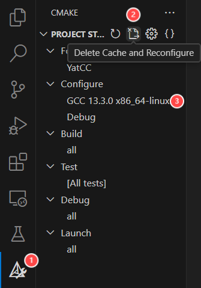
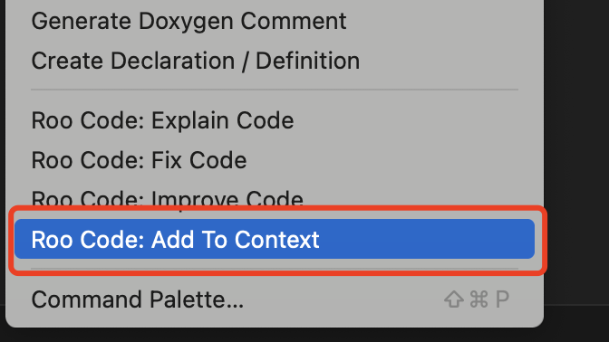
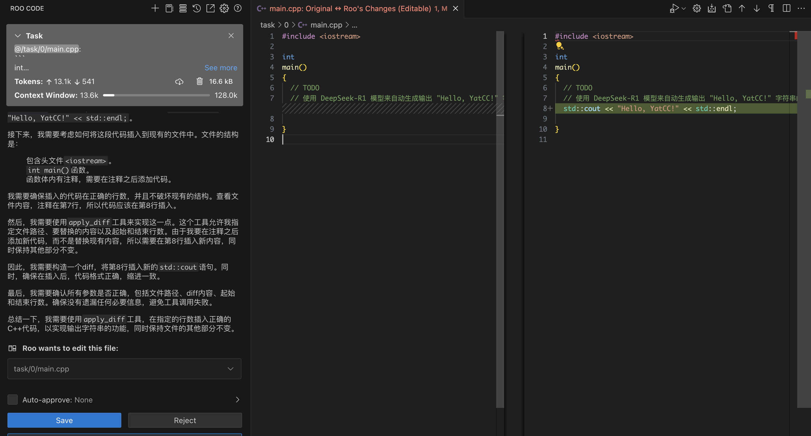
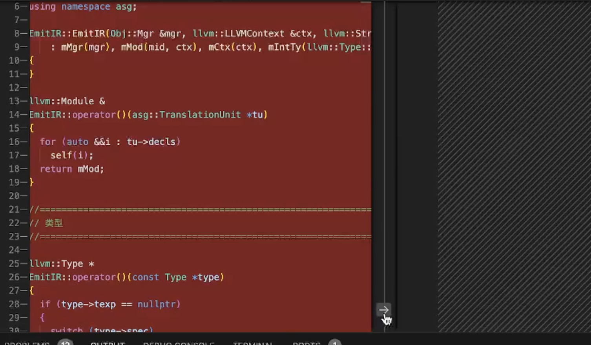

# 实验内容

实验 0 存在的目的是保证每一位同学都已经配置好了实验环境并且学会了使用实验框架，并且获得使用大语言模型来辅助代码开发的第一手体验。<u>在本次编译课程实验中，我们助教团队提供了 DeepSeek-R1</u>，为同学们提供大模型问答、代码修改等功能。

首先请同学们完成实验项目的配置。实现项目配置包括确定编译器版本、工具可用性、库文件位置等操作。要完成实验项目配置，同学们首先需要点击左侧插件菜单栏中的 CMAKE 按钮进入到如下图所示的界面，然后请同学们点击`Delete Cache and Reconfigure`这个按钮进行项目代码的配置。



此时 vscode 会弹出如下窗口要求你对编译此项目的编译器进行选择，请大家选择我们提前安装好的 GCC 即可(如果同学们之前选择过编译器这里就不会弹出窗口)。


如果最终在 output 一栏中显示`XX done`即可认为同学们已经成功完成了项目构建。


## 1. 完成 task0

`task0` 的任务非常简单，在 `task0` 目录下的 `main.cpp` 中大家就能看到以注释的形式所表明的任务要求。

```cpp
#include <iostream>

int
main()
{
  // TODO
  // 使用 DeepSeek-R1 模型来自动生成输出 "Hello, YatCC!" 字符串的代码语句

}
```

大家按照前言中所讲述的 AI 工具的使用方法，配置好了能够使用我们助教团队提供的 DeepSeek-R1 模型的 Roo Code 插件，此时便能够使用它来进行简单的代码生成任务，快速通过 `task0`～～～

> Roo Code 插件的图标是一个小火箭，喻示着借助大语言模型所提供的智能化服务，咱们的代码开发体验和速度就能像小火箭一样一飞冲天！

首先选择咱们需要进行代码生成的 `main` 函数，右键鼠标或者双击触摸板打开更多选项，视角往下划，选择 `Add To Context`， 将这段选中的代码作为与大语言模型聊天的上下文。



在打开的与 Roo Code 的聊天窗口中，选择模式为 Code 模式，此模式表示大语言模型将专注于生成代码，插件将会直接对源代码文件进行修改，并且显示出文件修改前后的差异。当然修改在最终落实到文件中时，会咨询用户的意见。

在聊天窗口中，我们输入提示词，期望大语言模型能够生成满足注释中的要求的代码语句，之后点击回车发送！


经过大语言模型的一通思考、回复和插件的操作后，我们的代码编辑器界面此时就变成了这样子，并且 Roo Code 插件也会询问用户是否有接受修改，左侧表示咱们的源代码文件，右侧则表示我们接受修改后源代码文件会变成的样子。绿色标识则表示增加的内容，如果左侧源代码文件中出现了红色标识，则表示插件删除了源代码文件中的某些代码语句，在 `task0` 中只会进行简单的代码生成，没有语句的删除，因此不会看到红色标识。



如果大家的代码编辑器窗口非常小，那么可能不会出现上图中所示的分别以左右两个窗口的形式展示修改前后的源代码文件，而仅仅只会显示修改后的文件。大家如果对修改不满意，只需要在聊天窗口中选择拒绝（Reject），此时源代码文件将不会有任何改变，否则，源代码文件将会变成上图中右侧窗口的模样。

如果插件误删了某些代码语句，同学们也不需要惊慌，将代码编辑器窗口变大后，可以点击中间的箭头来将删除的内容恢复，如下图所示（截自[我们的编译原理课程哔哩哔哩官方账号 Yat-Compiler 所投稿的视频](https://www.bilibili.com/video/BV1KhPcejEq5/?share_source=copy_web&vd_source=8faccdf10a2a91615b7b845f9b32eb8a)），此时在右侧窗口就会再现删除的内容。请同学们记住，如果接受修改，源代码文件就会变成右侧窗口的模样。



在上图中我们能够发现大语言模型提供的代码生成和插件所做的修改是正确的，因此在左侧聊天窗口中点击保存（Save），表示接受修改，那么代码生成任务就正确完成了！

值得注意的是，Roo Code 插件在用户接受修改后可能会继续向大语言模型发出请求，**如果同学们此时已经很满意目前的结果，记得点击聊天窗口中的取消（Cancel）按钮，以停止此次请求**。

`task0` 的任务非常简单，我们 `YatCC` 编译课程团队希望且鼓励大家尝试使用大语言模型来**辅助**实验的进行，以当前先进的 AI 技术赋能课程实验，获得第一手的 DeepSeek-R1 体验。

## 2. 构建 task0

按照下图所指引完成`task0`的构建。构建本质上是通过`cmake`构建名为`task0`的目标（对应的 cmake 指令为`cmake ... --target task0`），该指令将执行`task/0/CMakeLists.txt`中的内容，将同目录下的`main.cpp`编译为`task0`可执行文件。


当 vscode 输出栏中显示如下内容时代表构建成功。

```bash
[main] Building folder: YatCC task0
[build] Starting build
[proc] Executing command: /usr/bin/cmake --build /YatCC/build --config Debug --target task0 --
[build] [1/2  50% :: 0.661] Building CXX object task/0/CMakeFiles/task0.dir/main.cpp.o
[build] [2/2 100% :: 0.728] Linking CXX executable task/0/task0
[driver] Build completed: 00:00:00.781
[build] Build finished with exit code 0
```

## 3. 构建 task0-score

按照下图所指引完成`task0-score`的构建，获得 task0 的实验成绩。该构建将执行`test/task0/CMakeLists.txt`中的`task0-score`目标，运行上一步生成的`task0`并打印相关输出。


如果获得以下类似的输出代表操作正确。

```bash
[main] Building folder: YatCC task0-score
[build] Starting build
[proc] Executing command: /usr/bin/cmake --build /YatCC/build --config Debug --target task0-score --
[build] [1/1   0% :: 0.000] cd /YatCC/build/test/task0 && /usr/bin/python3.10 /YatCC/test/task0/score.py /YatCC/build/test/task0 /YatCC/build/task/0/task0
[build] task0 总分:100.0
[build]
[build] task0    100.00/100.00  Hello, SYsU-lang!
[build]
[build]
[driver] Build completed: 00:00:00.045
[build] Build finished with exit code 0
```

## 4. 构建 task0-pack

按照下图所指引完成`task0-pack`的构建，将 task0 的相关代码打包（在 task0 该步骤仅用于测试实验环境是否完成配置，对代码内容不作要求）。


同时输出窗口会输出打包好的代码文件到指定路径，方便同学们后续上传到评测机进行代码评测。**提交前请检查文件名称是否与本人信息相符**，若不相符则在`YatCC/config.cmake`中修改。

```bash
[main] Building folder: YatCC task0-pack
[build] Starting build
[proc] Executing command: /usr/bin/cmake --build /YatCC/build --config Debug --target task0-pack --
[build] [1/1 100% :: 0.008] cd /YatCC/task && /usr/bin/cmake -E tar cvfJ /YatCC/build/task/task0.0123456789-某某某.tar.xz /YatCC/task/0 && echo 作业已打包，请提交\ '/YatCC/build/task/task0.0123456789-某某某.tar.xz'\ 到评测服务器。 && echo 作业已打包，请提交\ '/YatCC/build/task/task0.0123456789-某某某.tar.xz'\ 到评测服务器。 && echo 作业已打包，请提交\ '/YatCC/build/task/task0.0123456789-某某某.tar.xz'\ 到评测服务器。
[build] 0
[build] 0/README.md
[build] 0/config.cmake
[build] 0/main.cpp
[build] 0/CMakeLists.txt
[build] 作业已打包，请提交 /YatCC/build/task/task0.0123456789-某某某.tar.xz 到评测服务器。
[build] 作业已打包，请提交 /YatCC/build/task/task0.0123456789-某某某.tar.xz 到评测服务器。
[build] 作业已打包，请提交 /YatCC/build/task/task0.0123456789-某某某.tar.xz 到评测服务器。
[driver] Build completed: 00:00:00.029
[build] Build finished with exit code 0
```
