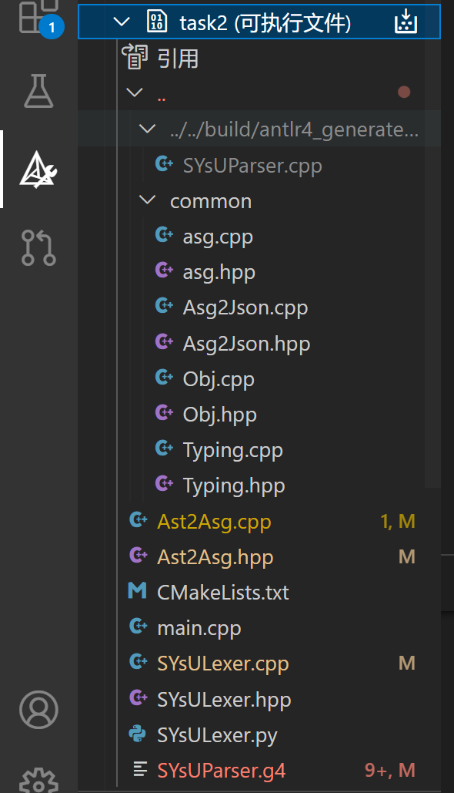
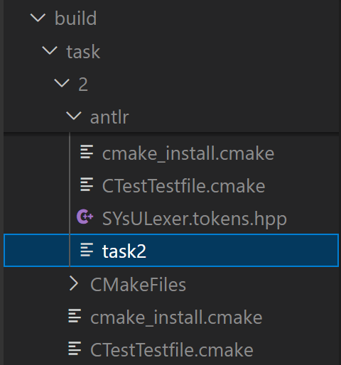
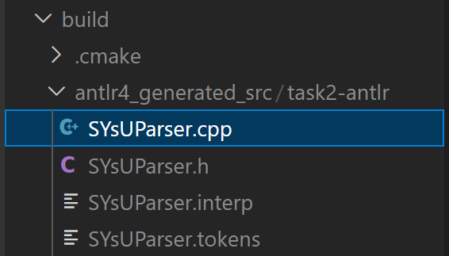
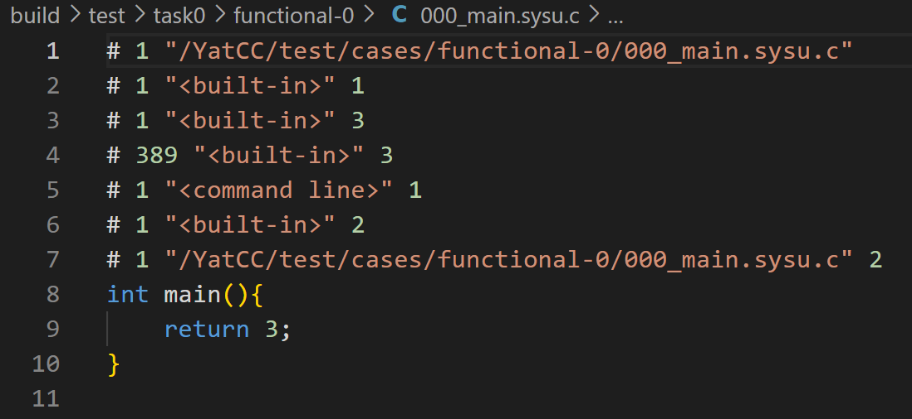
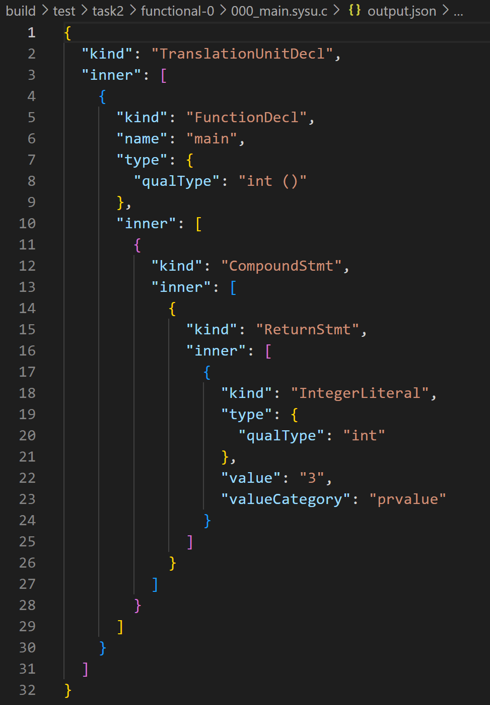

# 使用 antlr 完成 Task2

## 任务介绍

总的来说，本实验需要同学们做的事情有两个：

1. 前置工作：补充词法分析器缺失的部分。
   *  填写 `SYsULexer.tokens` 中所有测试样例需要用到的`token`名字。在构建项目时，已经写好的脚本 `SYsULexer.py` 会根据 `SYsULexer.tokens` 来生成文件 `SYsULexer.tokens.hpp`，来为 `SYsULexer.cpp` 提供一些`k`字母开头的`constexper`定义。
   *  在 `SYsULexer.cpp` 中对应位置添加`clang`风格的`token`名字与`k`开头的`token`名字的映射。前者是`build/task1/*/*/answer.txt`每行的第一个单词，后者将在本实验的 `SYsUParser.g4` 充当词法部分的 `token` 的命名。

2. 正式工作：补充缺失的文法规则和语义动作，实现语法分析器与从 AST 到 ASG 的转换。其中`SYsUParser.g4` 用于定义构建 AST 的文法规则，`Ast2Asg.cpp` 用于将 `antlr` 匹配得到的 AST 转换为 ASG。注意 `SYsUParser.g4` 与 `Ast2Asg.hpp/cpp` 需要同步更改：在 `SYsUParser.g4` 中修改了已有的规则就需要在 `Ast2Asg.hpp/cpp` 中对应的处理函数处做修改；如果在 `SYsUParser.g4` 中添加了新的规则就需要在 `Ast2Asg.cpp` 中添加新的处理函数，以保证 AST能够正确转换为 ASG。实现 `Ast2Asg.cpp` 的逻辑时，需要遵循 `asg.hpp` 中对 ASG 的定义。因此同学们需要认真阅读并理解 `asg.hpp` 。

接下来会先向大家讲解最基本的知识，并且在“上手思路”一节中手把手教大家完成本实验的方式。经过“上手思路”的培训后，同学们就可以尽情探索本实验的后续文档和内容了~

使用`antlr`完成实验时所需要用到的文件如下所示，其中`common`文件夹内的内容是不管使用`antlr`还是`bison`进行实现都需要用到的代码。

```bash
-- antlr
  |-- Ast2Asg.cpp      # 需要修改
  |-- Ast2Asg.hpp      # 需要修改
  |-- CMakeLists.txt
  |-- README.md
  |-- SYsULexer.cpp    # 需要修改
  |-- SYsULexer.hpp
  |-- SYsULexer.py
  |-- SYsULexer.tokens # 需要修改
  |-- SYsUParser.g4    # 需要修改
  `-- main.cpp
-- common              # 无需修改
   |-- Asg2Json.cpp
   |-- Asg2Json.hpp
   |-- Typing.cpp
   |-- Typing.hpp
   `-- asg.hpp
```

这些代码使用 `antlr` 实现了一个简单的语法分析器，用于将 `SYsU_lang` 语言的源代码转换为抽象语法树（AST），再进一步转换为抽象语法图（ASG），最后再将 ASG 转换为 JSON 格式进行输出。

（将 ASG 转换为 JSON 格式输出的原因是 ASG 是存在于内存中的不便于阅读的数据结构，输出为 JSON 格式方便同学们与实验标准答案对应的输出进行对比差错。）

简单来说，根据本实验的流程图，这些代码可分为 5 个部分：

1. 前缀为 `SYsULexer` 的四个文件是本实验的词法分析器部分；
2. `SYsUParser.g4` 定义了本实验的抽象语法树 AST ；
3. `Ast2Asg` 类用于将 AST 转换为 ASG ；
4. `Typing` 类用于对 ASG 进行类型推导和检查；
5. `Asg2Json` 类用于将 ASG 转换为 JSON 格式。


不过在本实验中，除了词法分析器部分的前置工作，同学们只需要修改 `SYsUParser.g4` 和 `Ast2Asg.cpp/hpp` 这两个部分即可。

同学们只需要编辑 `SYsUParser.g4` 以定义抽象语法树 AST （以 `g4` 为后缀名的文件 是 `antlr` 中用于定义词法规则和语法规则的文件）。这是完成语法分析器所需的唯一工作，除此之外这个语法分析器的其它工作已经由助教们预先在 `main.cpp` 中实现了。（感兴趣的同学可以自行借助“Task2 的程序做了什么”一节深入了解）

当然，本实验不会如此简单。在本实验中同学们需要将 AST 转换为 ASG 以获得额外的语义信息，为此同学们还需要完成 `Ast2Asg.cpp/hpp` 的填写。在这个过程中，同学们需要**重点关注** `asg.hpp` ，因为 `asg.hpp` 定义了本实验的 ASG 结构。只有弄懂了 ASG 的结构，才能正确填写 `Ast2Asg.cpp/hpp` 。

## 任务思路

### Task2 的程序做了什么

为了让同学们对实验二在做些什么有更深的理解，让我们先来回顾一下，在实验中，当同学们触发 `cmake` 插件中的一个个按钮时，究竟发生了什么吧！


当同学们通过 `cmake` 插件点击小小按钮来构建 task2 的可执行文件时，助教们写好的各种 `CMakeLists`脚本会将 task2 所有相关代码文件编译成一个可执行文件。同学们在 `cmake` 插件中的下拉选项中看见，到底有哪些文件参与进来。



当可执行文件编译完成后，同学们可以在 `build/task/2/antlr/` 目录下找到这个 task2 可执行文件。



从某种意义上讲，这就是在本实验中需要同学们完善的程序。当我们点击“ task2-score ”时，助教们写好的评测脚本将利用这个程序，用于处理测试样例的输入，进行语法分析生成 AST 再转换为 ASG ，最终输出代表 ASG 的 JSON 文件。这就是程序的行为。随后评测脚本继续根据输出的 JSON 文件与答案中正确的 JSON 文件进行对比，给出评分。


为什么程序的行为是这样的呢？让我们将目光放在 `main.cpp` 上，并且通过一个测试样例来理解 `main.cpp` 的行为。

`main.cpp` 是本实验的入口，直接反映了本实验的整体流程。

`main.cpp` 使用 `ANTLR` 的输入流接口和 `Lexer` 进行词法分析，生成 `token` 流。同理继续使用 `token` 流接口，通过 `Parser` 生成 AST 。

```cpp
  antlr4::ANTLRInputStream input(inFile);
  SYsULexer lexer(&input);

  antlr4::CommonTokenStream tokens(&lexer);
  SYsUParser parser(&tokens);

  auto ast = parser.compilationUnit();
```

这短短两段代码看起来相当神奇——它一下子就完成了词法分析和文法分析的工作。`SYsULexer` 来自实验二代码目录下的 `SYsULexer` 类， `SYsUParser` 则是来自 `antlr` 根据 `SYsUParser.g4` 生成的 `SYsUParser` 类。



实际上，实验二的输入和实验一的输入是一样的，都是实验零的输出，即经过预处理的测试样例代码。



但是在实验二中，对输入进行词法分析后，不会像实验一一样生成 txt 文件，而是转头又直接进行语法分析，直接得到一棵抽象语法树 AST。

接着 `main.cpp` 又进行一系列处理，最终将抽象语法树 AST 处理为易于打印的 JSON 格式的输出。

```cpp
  Obj::Mgr mgr;
  asg::Ast2Asg ast2asg(mgr);
  auto asg = ast2asg(ast->translationUnit());

  mgr.mRoot = asg;
  mgr.gc();

  asg::Typing inferType(mgr);
  inferType(asg);
  mgr.gc();

  asg::Asg2Json asg2json;
  llvm::json::Value json = asg2json(asg);
```

（其中的`Obj::Mgr` 类是一个对象管理器，负责垃圾回收方面的工作。感兴趣的同学可以看看这篇由本实验的总工程师[顾宇浩](https://yhgu2000.github.io/)师兄写的[博客](https://yhgu2000.github.io/posts/%E4%B8%AD%E5%B1%B1%E5%A4%A7%E5%AD%A6SYsUlang%E5%AE%9E%E9%AA%8C%E6%94%BB%E7%95%A5/)。）

首先，`main.cpp` 创建了一个 `Ast2Asg` 实例，用于将 AST 转换为抽象语法图 ASG 结构。对于包含着语义信息的 ASG ，我们无法确保 ASG 的语义合法性，因此 `main.cpp` 又通过 `Typing` 类对 ASG 中的节点执行类型检查与推导（至于具体为什么以及如何进行类型检查与推导，感兴趣的同学可以看看“其他资料推荐”一节）。最后，由于 AST 和 ASG 作为类树类图的数据结构，都不是易于打印输出的结构，因此 `main.cpp` 创建了一个 `Asg2Json` 实例，将 ASG 转换为 JSON 格式的数据，再输出到指定的路径中，得到了如下输出。



### 填写词法分析部分（前置工作）

助教们提前实现了实验二和实验一的解耦，将实验二的词法分析器的输入由实验一的源代码文件修改为了实验一的`answer.txt`文件（保证实验一没有完全做出来的同学，在做实验二的时候不受影响），具体流程如下图所示。


但是在解耦这一部分时，出于避免给 task1 提供不必要的提示的考量，我们留下了一些工作需要同学们完成。我们在 task2 的词法分析器的部分挖了空，这些内容与 task1 的工作相对应，因此若同学们完成了 task1 ，就能够将 task2 中这部分对应的词法分析器填写。（task1 的答案会在 task1 截止后提供）

```bash
-- antlr
  |-- SYsULexer.cpp     # 需要修改
  |-- SYsULexer.hpp
  |-- SYsULexer.py
  `-- SYsULexer.tokens  # 需要修改
```

我们提前为同学们手写了 `SYsULexer` 类，同学们需要先填写 `SYsULexer.tokens` 中所有测试样例需要用到的`token`名字。在构建项目时，`SYsULexer.py` 会根据 `SYsULexer.tokens` 来生成 `SYsULexer.tokens.hpp`，来为 `SYsULexer.cpp` 提供一些`k`字母开头的`constexper`定义。然后同学们需要在 `SYsULexer.cpp` 中对应位置添加`clang`风格的`token`名字（也就是`answer.txt`每行的第一个单词）与`k`开头的`token`名字的映射。


因此同学们只需要填写 `/task/2/antlr/SYsULexer.tokens` 和 `/task/2/antlr/SYsULexer.cpp` 。这就是 task2 的第一个任务。

在同学们完成词法单元的名字填写之前，直接运行从远程仓库拉下来的代码大概能得到 20 分左右。按照指引填写词法单元的名字映射之后，此时重新运行评分脚本同学们会发现评分有所增加。

### 定义 AST

```bash
-- antlr
  |-- Ast2Asg.cpp
  |-- Ast2Asg.hpp
  `-- SYsUParser.g4
-- common
  `-- asg.hpp
```

以 `g4` 为后缀名的文件是 `antlr` 中用于定义词法规则和语法规则的文件。其中 `ANTLR` 规定以大写字母开头定义的语句用于定义词法规则，以**小写字母**开头定义的语句用于定义**语法规则**。（请同学们参考 `SYsUParser.g4` 中已填写的部分来理解 `g4` 文件**本身的**语法规则。若有更多疑问，可以求助于 LLM 助手。）

因此，同学们需要填写 `SYsUParser.g4` 以定义 AST。定义 AST 的方式大家将在或已经在课堂上学习过了，这里不再赘述。

然而，由于 AST 是存在于内存中的不便于阅读的数据结构，为了确保同学们确实理解 AST 的结构，我们加入了将 AST 转换为 ASG 的任务，这是同学们的工作。从 AST 到 ASG 的转换同时增加了额外的语义信息，如作用域、类型信息、变量和函数之间的关系等。最后 ASG 会经过一系列转换得到具有可读性的 JSON 文件，不过这些转换已经实现好了。

### From AST to ASG

`Ast2Asg.cpp` 和 `Ast2Asg.hpp` 中的 `Ast2Asg` 类负责将 AST 转换为 ASG。包括对各种语法结构（如表达式、语句、声明等）的处理方法。
`Ast2Asg` 相关的代码在 `main.cpp` 中是通过如下方法进行调用的。

```cpp
  asg::Obj::Mgr mgr;
  asg::Ast2Asg ast2asg(mgr);
  auto asg = ast2asg(ast->translationUnit());
```

上面这段代码发生了从 AST（抽象语法树）到 ASG（抽象语法图）的转换过程。下面是详细的解释：

```cpp
asg::Ast2Asg ast2asg(mgr);
```

首先，代码创建了 `Ast2Asg` 类的一个实例 `ast2asg`，并将对象管理器 `mgr` 作为构造函数的参数传递给它。（这个对象管理器 mgr 负责在 AST 到 ASG 的转换过程中创建和管理所有 ASG 节点的生命周期。）

```cpp
auto asg = ast2asg(ast->translationUnit());
```

然后，代码调用了 `ast2asg` 实例的操作符 `()` 函数，传入了由 `ANTLR` 生成的 AST 的根节点 —— 通常是表示整个程序的 `translationUnit` 节点。这个函数的任务是遍历 AST，为每个节点创建相应的 ASG 节点，并根据 AST 节点之间的关系构建 ASG 的结构。其中的过程细节是：

1. 遍历AST：函数首先遍历 AST 的每个节点。AST 是根据源代码的语法结构自顶向下递归构建的树形结构，每个节点代表了源代码中的一个语法结构（如表达式、语句、声明等）。
2. 节点转换：对于 AST 的每个节点，`Ast2Asg` 类中定义的对应的转换方法会被调用。这些方法负责将 AST 节点转换为 ASG 节点。转换过程中可能会创建新的 ASG 节点对象，并利用对象管理器 `mgr` 进行管理。
3. 构建ASG结构：在转换各个 AST 节点的同时，转换方法还会根据 AST 节点之间的父子关系和兄弟关系来构建 ASG 的图形结构。这一步骤确保了转换后的 ASG 能够准确反映程序的逻辑结构和语法结构。
4. 返回 ASG 的根节点：整个转换过程完成后，`ast2asg(ast->translationUnit())` 会返回转换后的 ASG 的根节点。这个根节点代表了整个程序的抽象语法图，是后续编译过程中进行语义分析、优化和代码生成等操作的基础。

从**抽象语法树（Abstract Syntax Tree，AST）**，


到**抽象语义图（Abstract Semantic Graph，ASG）**。


这个“根据 AST 节点之间的关系构建 ASG 的结构”的过程，需要同学们通过修改在 `Ast2Asg` 类来完成。不断完善已有逻辑，实现新的逻辑，直至拿到满分。

### 上手思路

这里先介绍一下这个实验做起来的大致流程。之后再具体地介绍 `Ast2Asg` 类。

与实验一相似，同学们需要对一个个测试样例进行攻克。通过执行评测，找到未通过的测试样例与缺失的语法规则。对于某个特定的缺失语法，先填写 `SYsUParser.g4` 以定义 AST 中新的语法规则，再填写 `Ast2Asg` 类中的新的处理逻辑，才算完成该语法规则的任务，拿到对应测试样例的全部分数。

接下来我们会以一些测试样例为例进行一些演示。

运行评分脚本，同学们会看到下图所示的几个样例是同学们首先要解决的。


观察 `/YatCC-P/build/test/task0/functional-1` 中的第 17 到 22 个测试样例我们会找到，这几个测试样例中新出现的尚未实现语法规则。（此时我们建议同学们观察 `/build/test/task0/` 中的源码。这是因为 task0 对源码进行了预处理，**有时预处理的结果会向我们展示更多有用细节**。）

```cpp
a * 5
a / b
a / 5
a / 3
a % 3
```

现在，我们需要先在`SYsUParser.g4`中添加乘法表达式、除法表达式以及取模表达式的语法规则。

由于大家 `pull` 代码之后还没有对 `g4` 文件做任何修改，它是如下图所示的。

```cpp
postfixExpression
    :   primaryExpression
    ;

unaryExpression
    :
    (postfixExpression
    |   unaryOperator unaryExpression
    )
    ;

unaryOperator
    :   Plus | Minus
    ;

additiveExpression
    :   unaryExpression ((Plus|Minus) unaryExpression)*
    ;
```

对于添加乘法、除法以及取模运算的语法规则，自然需要考虑这些运算表达式和 `additiveExpression` 的优先级关系。所以我们采取了一个很巧妙的方式实现了这些新的表达式规则。

```cpp
multiplicativeExpression
    :   unaryExpression ((Star|Div|Mod) unaryExpression)*
    ;

additiveExpression
    :   multiplicativeExpression ((Plus|Minus) multiplicativeExpression)*
    ;
```

因为在`multiplicativeExpression`中`((Star|Div|Mod) unaryExpression)*`带了一个`*`（这意味着括号内的一堆东西可以出现 0 次），所以我们可以认为`multiplicativeExpression`可以匹配到`unaryExpression`，这种情况下就退化到了同学们拿到手里的代码：

```cpp
additiveExpression
    :   unaryExpression ((Plus|Minus) unaryExpression)*
    ;
```

同时也很好理解下面的代码既可以代表加号左右都是 `multiplicativeExpression` 的情况，又可以代表加号左右一侧是`unaryExpression`，一侧是 `multiplicativeExpression` 的情况，还可以代表加号的左右两侧都是 `unaryExpression` 的情况：

```cpp
additiveExpression
    :   multiplicativeExpression ((Plus|Minus) multiplicativeExpression)*
    ;
```

那么到这里就完成了我们前面所说的步骤一：对当前测例中新出现的语法规则在`SYsUParser.g4`文件中进行了规则的添加。

请同学们注意，在 `SYsUParser.g4` 中修改了已有的规则就需要在 `Ast2Asg.cpp` 中对应的处理函数处做修改。如果在 `SYsUParser.g4` 中添加了新的规则，就需要在 `Ast2Asg.cpp` 中添加新的处理函数，才能使测试样例通过评测。

因为我们刚刚步骤一的操作修改了`additiveExpression`，我们在 `Ast2Asg.cpp` 中找到下面的重载函数，那么同学们可能会有疑问，如何把这些重载函数和我们的 `SYsUParser.g4` 中的语法规则进行对应呢？**通过传入参数即可判断**，我们找到的这个重载函数的传入参数是 `additiveExpression` 加上 `Context` 类型的指针。

```cpp
Expr*
Ast2Asg::operator()(ast::AdditiveExpressionContext* ctx)
{
  auto children = ctx->children;
  Expr* ret = self(dynamic_cast<ast::UnaryExpressionContext*>(children[0]));

  for (unsigned i = 1; i < children.size(); ++i) {
    auto node = make<BinaryExpr>();

    auto token = dynamic_cast<antlr4::tree::TerminalNode*>(children[i])
                   ->getSymbol()
                   ->getType();
    switch (token) {
      case ast::Plus:
        node->op = node->kAdd;
        break;

      case ast::Minus:
        node->op = node->kSub;
        break;

      default:
        ABORT();
    }

    node->lft = ret;
    node->rht = self(dynamic_cast<ast::UnaryExpressionContext*>(children[++i]));
    ret = node;
  }

  return ret;
}
```

同学们心中可能还有一个疑问，`ast::AdditiveExpressionContext* ctx`是一个什么东西呢？由于这个指针变量是 `antlr` 自动生成的代码中的变量类型，我们不需要进行修改，但是可以通过 `vscode` 的 `转到定义` 功能跳转到它的定义代码那里去了解。在这里我们只需要知道如何利用这个变量获取到我们想要的信息即可。

上述代码中 `auto children = ctx->children;` 中的 `ctx->children` 可以获取到当前加法表达式上下文节点的所有子节点。在 ANTLR 生成的语法分析树中，每个节点可能有多个子节点，它们代表了该表达式的组成部分（例如，在表达式`a + b`中，`a`、`+`和`b`是子节点。）

同学们还记得你们拿到的代码吗

```cpp
additiveExpression
    :   unaryExpression ((Plus|Minus) unaryExpression)*
    ;
```

这里的 `unaryExpression` 会被 `children[0]` 获取到，然后 `*` 代表出现 0 次或者无数次，那么 `children[i]` 如果存在的话代表能够获取到 `((Plus|Minus) unaryExpression)` 。所以接下来如果上面的函数能进入循环的话，循环首先会执行以下代码：

```cpp
auto node = make<BinaryExpr>();
```

通过对 `BinaryExpr` 进行右键点击->转到定义，会得到如下代码，这些代码是 `asg.hpp` 中的内容，是 ASG 定义的一部分。（它们位于 `common` 文件夹中。`common` 文件夹中的所有代码都是不需要同学们进行修改的。）

**注意！实现 `Ast2Asg.cpp` 的逻辑时，需要遵循 `asg.hpp` 中对 ASG 的定义。只有理解了 ASG 的定义，才能正确理解 AST 到 ASG 的转换。**

因此，认真理解 `asg.hpp` 的内容对完成实验有很大的帮助！！

```cpp
struct BinaryExpr : Expr
{
  enum Op
  {
    kINVALID,
    kMul,
    kDiv,
    kMod,
    kAdd,
    kSub,
    kGt,
    kLt,
    kGe,
    kLe,
    kEq,
    kNe,
    kAnd,
    kOr,
    kAssign,
    kComma,
    kIndex,
  };
```

言归正传，有了上述的铺垫，`switch` 代码段中的代码同学们可以很容易地进行理解了。

接下来是：

```cpp
    node->lft = ret;
    node->rht =
      self(dynamic_cast<ast::UnaryExpressionContext*>(children[++i]));
    ret = node;
```

这段代码具体的作用是构建一个表示加法或减法操作的二元表达式树节点。这里的 `node` 是一个新创建的 `BinaryExpr` 对象，它代表了一个加法或减法运算。代码的主要步骤如下：

- `node->lft = ret;`。这行代码将 `node` 的左子节点即 `lft` 设置为之前计算的表达式结果`ret`。在加法或减法表达式中，`ret`可以是前一个操作的结果，或者如果这是第一个操作，则是第一个操作数。
- `node->rht = self(dynamic_cast<ast::UnaryExpressionContext*>(children[++i]));`。这行代码处理加法或减法运算的右侧表达式。它首先通过`children[++i]`获取下一个子节点（即右侧的操作数），然后将这个子节点强制转换为`UnaryExpressionContextContext`类型，表示这是一个`UnaryExpression`。这个转换后的节点被传递给当前函数的递归调用`self()`，以解析这个子表达式并获取其计算结果。这个结果随后被设置为`node`的右子节点(`rht`)。

介绍完同学们拿到的代码中的 `Expr* Ast2Asg::operator()(ast::AdditiveExpressionContext* ctx)` 函数之后，我们就知道如何为 `SYsUParser.g4` 中的新规则添加新的 `Ast2Asg.cpp` 的处理函数了。

由于我们将

```cpp
additiveExpression
    :   unaryExpression ((Plus|Minus) unaryExpression)*
    ;
```

修改为了

```cpp
additiveExpression
    :   multiplicativeExpression ((Plus|Minus) multiplicativeExpression)*
    ;
```

所以我们需要将

```cpp
Expr*
Ast2Asg::operator()(ast::AdditiveExpressionContext* ctx)
{
  auto children = ctx->children;
  Expr* ret = self(dynamic_cast<ast::UnaryExpressionContext*>(children[0]));

  for (unsigned i = 1; i < children.size(); ++i) {
    auto node = make<BinaryExpr>();

    auto token = dynamic_cast<antlr4::tree::TerminalNode*>(children[i])
                   ->getSymbol()
                   ->getType();
    switch (token) {
      case ast::Plus:
        node->op = node->kAdd;
        break;

      case ast::Minus:
        node->op = node->kSub;
        break;

      default:
        ABORT();
    }

    node->lft = ret;
    node->rht = self(dynamic_cast<ast::UnaryExpressionContext*>(children[++i]));
    ret = node;
  }

  return ret;
}
```

修改成为

```cpp
Expr*
Ast2Asg::operator()(ast::AdditiveExpressionContext* ctx)
{
  auto children = ctx->children;
  // assert(dynamic_cast<ast::UnaryExpressionContext*>(children[0]));
  Expr* ret =self(dynamic_cast<ast::MultiplicativeExpressionContext*>(children[0]));

  for (unsigned i = 1; i < children.size(); ++i) {
    auto node = make<BinaryExpr>();

    auto token = dynamic_cast<antlr4::tree::TerminalNode*>(children[i])
                   ->getSymbol()
                   ->getType();
    switch (token) {
      case ast::Plus:
        node->op = node->kAdd;
        break;

      case ast::Minus:
        node->op = node->kSub;
        break;

      default:
        ABORT();
    }

    node->lft = ret;
    node->rht =
      self(dynamic_cast<ast::MultiplicativeExpressionContext*>(children[++i]));
    ret = node;
  }

  return ret;
}
```

并且由于我们在`SYsUParser.g4`文件中添加了

```cpp
multiplicativeExpression
    :   unaryExpression ((Star|Div|Mod) unaryExpression)*
    ;
```

所以我们需要对应地在`Ast2Asg.cpp`添加

```cpp
Expr*
Ast2Asg::operator()(ast::MultiplicativeExpressionContext* ctx)
{
  auto children = ctx->children;
  Expr* ret = self(dynamic_cast<ast::UnaryExpressionContext*>(children[0]));

  for (unsigned i = 1; i < children.size(); ++i) {
    auto node = make<BinaryExpr>();

    auto token = dynamic_cast<antlr4::tree::TerminalNode*>(children[i])
                   ->getSymbol()
                   ->getType();
    switch (token) {
      case ast::Star:
        node->op = node->kMul;
        break;

      case ast::Div:
        node->op = node->kDiv;
        break;

      case ast::Mod:
        node->op = node->kMod;
        break;

      default:
        ABORT();
    }

    node->lft = ret;
    node->rht = self(dynamic_cast<ast::UnaryExpressionContext*>(children[++i]));
    ret = node;
  }

  return ret;
}
```

以及在`Ast2Asg.hpp`中添加：

```cpp
 Expr* operator()(ast::MultiplicativeExpressionContext* ctx);
```

如此，便完成了对乘法运算的语法规则的添加。同学们可以按步骤尝试后执行评测，看看是否成功通过对应测试样例。

刚刚我们提到，同学们可以查看评测中未通过的测试样例来看看需要实现什么语法规则。除此之外，同学们还可以根据 `asg.hpp` 的内容来看看整体的工作量。毕竟 `asg.hpp` 定义了 ASG ——实验中 AST 的转换目标。

下面是 `asg.hpp` 的主体结构。（对于一些结构体的含义不太清楚的，可以通过 `asg2json.cpp` 中的每个结构的打印方式即可知道该结构体对应的是什么。建议同学们都看看 `asg2json.cpp` 这样对结构体的含义更为清晰，也以免出错。）

```cpp
namespace asg {

//==============================================================================
// 类型
//==============================================================================
struct TypeExpr;
struct Expr;
struct Decl;
struct Type : Obj；   /* Type用于表示节点的类型信息，包括基本类型和复合类型 */
struct TypeExpr : Obj；   /* 表示更复杂的类型表达，如数组和函数类型 */
struct PointerType : TypeExpr；
struct ArrayType : TypeExpr；
struct FunctionType : TypeExpr；

//==============================================================================
// 表达式
//==============================================================================
struct Decl;
struct Expr : Obj；    /* Expr表示所有表达式节点的基类，比如字面量、二元运算、函数调用等 */
struct IntegerLiteral : Expr；
struct StringLiteral : Expr；
struct DeclRefExpr : Expr； //表示对声明的引用
struct ParenExpr : Expr；  //表示带括号的表达式
struct UnaryExpr : Expr；  //一元表达式
struct BinaryExpr : Expr；  /* 表示二元表达式 */
struct CallExpr : Expr；   /* 表示函数调用的语法树节点 */
struct InitListExpr : Expr；  /* 初始化列表（如数组或结构体初始化） */
struct ImplicitInitExpr : Expr；  /* 被用来表示某种隐式初始化的表达式 */
struct ImplicitCastExpr : Expr；   //表示隐式类型转换表达式

//==============================================================================
// 语句
//==============================================================================
struct FunctionDecl;
struct Stmt : Obj  /* 所有语句的基类，例如表达式语句和符合语句 */
struct NullStmt : Stmt
struct DeclStmt : Stmt
struct ExprStmt : Stmt
struct CompoundStmt : Stmt
struct IfStmt : Stmt
struct WhileStmt : Stmt
struct DoStmt : Stmt
struct BreakStmt : Stmt
struct ContinueStmt : Stmt
struct ReturnStmt : Stmt

//==============================================================================
// 声明
//==============================================================================
struct Decl : Obj  /* 表示所有声明的基类，例如变量声明和函数声明 */
struct VarDecl : Decl  /* 变量variable声明 */
struct FunctionDecl : Decl  /* 函数声明 */

//==============================================================================
// 顶层
//==============================================================================
struct TranslationUnit : Obj   /* 代表整个程序或一个编译单元，是ASG的根节点 */

} // namespace asg
```

在本小节的最后，做一个简单的总结，需要同学们进行修改的代码文件有：

```bash
/task/2/antlr/SYsULexer.tokens
/task/2/antlr/SYsULexer.cpp
/task/2/antlr/SYsUParser.g4
/task/2/antlr/Ast2Asg.cpp
/task/2/antlr/Ast2Asg.hpp
```

注意 `common` 文件夹中的代码不需要进行修改。

需要同学们做的事情有两个：

1. 同学们需要先填写 `SYsULexer.tokens` 中所有测试样例需要用到的`token`名字。在构建项目时，`SYsULexer.py` 会根据 `SYsULexer.tokens` 来生成 `SYsULexer.tokens.hpp`，来为 `SYsULexer.cpp` 提供一些`k`字母开头的`constexper`定义。然后同学们需要在 `SYsULexer.cpp` 中对应位置添加`clang`风格的`token`名字（也就是`answer.txt`每行的第一个单词）与`k`开头的`token`名字的映射。

2. 在 `SYsUParser.g4 `中修改了已有的规则就需要在 `Ast2Asg.cpp` 中对应的处理函数处做修改。如果在 `SYsUParser.g4` 中添加了新的规则就需要在 `Ast2Asg.cpp` 中添加新的处理函数。并且如果 `Ast2Asg.cpp` 中有新增函数，`hpp` 文件需要同步更新。实现 `Ast2Asg.cpp` 的逻辑时，需要遵循 `asg.hpp` 中对 ASG 的定义！

看完了上手思路，希望同学们已经对执行任务时的过程有一定的理解。接下来会向大家更具体地介绍 `Ast2Asg.cpp` 的内部细节。

## Ast2Asg 类详情

### Ast2Asg 类定义

Ast2Asg 类负责将由 ANTLR 解析器生成的 AST 转换为更方便处理的 ASG 形式。它包含一个对象管理器（Obj::Mgr）的引用，用于创建和管理 AST 节点对应的 ASG 节点。

```cpp
class Ast2Asg
{
public:
  Obj::Mgr& mMgr;

  Ast2Asg(Obj::Mgr& mgr)
    : mMgr(mgr)
  {
  }

  TranslationUnit* operator()(ast::TranslationUnitContext* ctx);
  ...
  Decl* operator()(ast::InitDeclaratorContext* ctx, SpecQual sq);

private:
  struct Symtbl;
  Symtbl* mSymtbl{ nullptr };

  FunctionDecl* mCurrentFunc{ nullptr };

  template<typename T, typename... Args>
  T* make(Args... args)
  {
    return mMgr.make<T>(args...);
  }
};
```

- 类成员变量 `Obj::Mgr& mMgr` 是对对象管理器的引用，用于创建和管理AST节点对象。（感兴趣的同学可以看看这篇由本实验的总工程师[顾宇浩](https://yhgu2000.github.io/)师兄写的[博客](https://yhgu2000.github.io/posts/%E4%B8%AD%E5%B1%B1%E5%A4%A7%E5%AD%A6SYsUlang%E5%AE%9E%E9%AA%8C%E6%94%BB%E7%95%A5/)。）
- 构造函数接受一个对象管理器的引用，用于初始化 `mMgr` 成员。
- `operator()` 方法被重载多次，每个重载对应处理AST中不同节点类型的转换逻辑。
- `SpecQual` 是一个类型别名，用于表示变量或函数的类型和限定符。
- `Symtbl` 结构是一个符号表，用于在转换过程中管理作用域内的符号信息。
- `mSymtbl` 成员指向当前的符号表，`mCurrentFunc` 指向当前正在处理的函数声明，以便在处理表达式时可以访问函数的上下文信息。
- `make<T>()` 模板函数用于通过对象管理器创建新的 AST 节点对象。

`Ast2Asg` 类的方法主要负责将AST中的每个节点转换为ASG的对应表示。包括但不限于：

- 处理整个编译单元（`TranslationUnit`）。
- 转换类型说明符（`DeclarationSpecifiersContext`）和声明符（`DeclaratorContext`、`DirectDeclaratorContext`）。
- 转换各种表达式（如`AssignmentExpressionContext`、`AdditiveExpressionContext`等）。
- 转换语句（`StatementContext`、`CompoundStatementContext`等）。
- 转换声明和函数定义（`DeclarationContext`、`FunctionDefinitionContext`等）。

### Symtbl 结构实现作用域

```cpp
struct Ast2Asg::Symtbl : public std::unordered_map<std::string, Decl*>
{
  Ast2Asg& m;
  Symtbl* mPrev;

  Symtbl(Ast2Asg& m)
    : m(m)
    , mPrev(m.mSymtbl)
  {
    m.mSymtbl = this;
  }

  ~Symtbl() { m.mSymtbl = mPrev; }

  Decl* resolve(const std::string& name);
};
```

- 作用: `Symtbl` 是一个内嵌在 `Ast2Asg` 类中的结构，用于实现符号表，保存当前作用域内所有声明的符号及其对应的声明节点。它继承自 `std::unordered_map<std::string, Decl*>`，键是符号名称，值是指向声明节点的指针。
- 字段:
  `Ast2Asg& m`: 引用外层的 `Ast2Asg` 对象，以便于访问其成员。
  `Symtbl* mPrev`: 指向上一个符号表的指针，用于实现作用域的嵌套。
- 构造和析构函数:
  构造函数中，将新创建的符号表实例设置为当前符号表，并将旧的符号表保存为 `mPrev`。
  析构函数中，将符号表恢复到上一个符号表。

### resolve 方法检索作用域

```cpp
Decl*
Ast2Asg::Symtbl::resolve(const std::string& name)
{
  auto iter = find(name);
  if (iter != end())
    return iter->second;
  ASSERT(mPrev != nullptr); // 标识符未定义
  return mPrev->resolve(name);
}
```

- 作用: 在符号表中查找给定名称的符号的声明，如果当前作用域中没有找到，会递归地在上一个作用域中查找。
- 参数: `const std::string& name` - 需要查找的符号名称。
- 返回: 找到的 `Decl*`，给定名称的符号的声明。如果给定名称的符号不曾定义，则断言失败。

### `Ast2Asg`其他关键方法

一、

```cpp
TranslationUnit*
Ast2Asg::operator()(ast::TranslationUnitContext* ctx)
{
  auto ret = make<asg::TranslationUnit>();
  if (ctx == nullptr)
    return ret;

  Symtbl localDecls(self);

  for (auto&& i : ctx->externalDeclaration()) {
    ...
  }

  return ret;
}
```

其中这个方法负责处理整个编译单元（通常是一个文件），它接收`ANTLR`生成的 `TranslationUnitContext` 对象作为参数，这个对象代表了整个文件的AST根节点。

- 首先，它创建了一个 `asg::TranslationUnit` 对象，这是 ASG 中对应的根节点。

```cpp
  for (auto&& i : ctx->externalDeclaration()) {
    if (auto p = i->declaration()) {
      auto decls = self(p);
      ret->decls.insert(ret->decls.end(), std::make_move_iterator(decls.begin()), std::make_move_iterator(decls.end()));
    }

    else if (auto p = i->functionDefinition()) {
      auto funcDecl = self(p);
      ret->decls.push_back(funcDecl);

      // 添加到声明表
      localDecls[funcDecl->name] = funcDecl;
    }

    else
      ABORT();
  }
```

- 然后，通过遍历 AST 中的所有外部声明（`externalDeclaration`），将它们转换为 ASG 中的声明和函数定义，并添加到 `asg::TranslationUnit` 的声明列表中。
- 如果遇到函数定义，还会将函数名添加到当前作用域的符号表中。

二、

```cpp
Ast2Asg::SpecQual Ast2Asg::operator()(ast::DeclarationSpecifiersContext* ctx)
```

这个方法处理变量或函数的类型说明符，例如 `const` 、`int` 或 `char` 等。其中,

```cpp
SpecQual ret = { Type::Spec::kINVALID, Type::Qual() };

for (auto&& i : ctx->declarationSpecifier()) {
  ...
}
```

它遍历AST节点中的所有类型说明符，确定变量或函数的类型，并返回一个包含类型和限定符的 `SpecQual` 对象。

三、

```cpp
std::pair<TypeExpr*, std::string> Ast2Asg::operator()(ast::DeclaratorContext* ctx, TypeExpr* sub)
//这个方法处理声明符（declarator）。它可能包含数组、函数等更复杂的类型信息。
//方法接收一个声明上下文和可能的子类型表达式（例如数组的元素类型），并返回一个包含类型表达式和变量名的pair。


Expr* Ast2Asg::operator()(各种表达式的Context* ctx)
//这些方法处理AST中的各种表达式类型（如赋值表达式、二元表达式、一元表达式等）。实现了将AST中的表达式节点转换为ASG节点的转换逻辑。
//例如，Expr* Ast2Asg::operator()(ast::AssignmentExpressionContext* ctx) 处理赋值表达式，创建并返回一个表示赋值的 Expr 节点。


Stmt* Ast2Asg::operator()(ast::StatementContext* ctx) 和 CompoundStmt* Ast2Asg::operator()(ast::CompoundStatementContext* ctx)
//这些方法处理AST中的语句和复合语句。

operator()(ast::StatementContext* ctx) //根据语句类型调用相应的转换方法。
operator()(ast::CompoundStatementContext* ctx) //转换复合语句，处理其中的每一条语句或声明，并创建一个 CompoundStmt 节点。


std::vector<Decl*> Ast2Asg::operator()(ast::DeclarationContext* ctx)
FunctionDecl* Ast2Asg::operator()(ast::FunctionDefinitionContext* ctx)
//这些方法处理声明和函数定义。

operator()(ast::DeclarationContext* ctx) //转换变量声明，创建 Decl 节点的列表。
operator()(ast::FunctionDefinitionContext* ctx) //处理函数定义，创建一个 FunctionDecl 节点，并处理函数体和参数。
```

整体上，`Ast2Asg.cpp` 中定义的 `Ast2Asg` 类通过这些方法实现了从 `ANTLR` 的 AST 到 ASG 的转换，涵盖了编程语言的主要构造：表达式、语句、声明和函数定义。转换过程中，它还处理了类型信息和作用域信息，为后续的语义分析和代码生成提供了基础。

## 其他资料推荐

### 类型、类型检查与推导

同学们做实验的过程中，可能会发现，ASG 的类型系统有些复杂难以理解。可以看看这个实验路径下的文章： `/YatCC/docs/gyh-manual/类型、类型检查与推导.md`

这个路径下的其他文章也很值得一读，同学们会发现它们都深入到这个实验的底层设计理念，显得相当硬核，或许能给予实验中的启发。不过需要注意的是，其中的一些信息可能已经过时。
