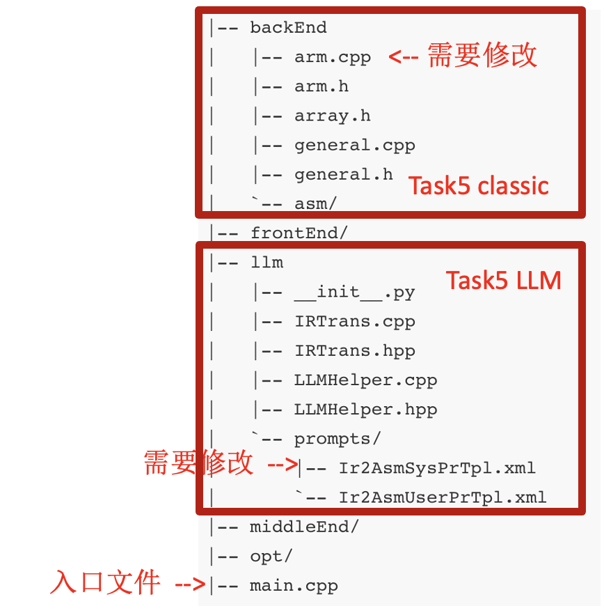

# 整体介绍

恭喜同学们完成前四个实验，在实验一到四中，同学们已经分别完成了词法分析器，语法分析器，中间代码生成器以及中间代码优化器。在前四个实验中，同学们已经完成了编译器的前端和中端部分，在本次实验中，同学们将需要完成编译器的**后端指令选择**部分。

在本次实验中，有两种实现路径

- **传统方法**：补充框架代码关键逻辑，实现指令选择功能
- **大语言模型方法**：补充Prompts，引导大语言模型完成从IR到ARM汇编的转变

# 任务描述

## 概述

在本次实验中，同学们需要完成后端代码生成中的指令选择部分，完成IR到Machine IR的转换。

从ASG转换到ARM汇编需要很多步骤，如下图所示

需要进行指令选择转换成含虚拟寄存器的Machine IR，然后进行寄存器分配，将虚拟寄存器与实际寄存器进行绑定，然后经过窥孔优化进行一些简单的优化（强度衰减、常量折叠等），最后进行栈帧管理，用于组织局部变量、保存上下文信息等。

而指令选择是将平台无关的 LLVM IR 翻译成 平台相关的 Machine IR部分。Machin IR是在 LLVM IR 和目标机器指令之间的过渡表示，其更贴近底层硬件指令，且与平台相关，需要添加许多目标平台的特性，拥有以下特征

- 虚拟寄存器：指令操作数存放在虚拟寄存器中，通过寄存器分配后放入实体寄存器
- 平台相关性：指令的类型功能与ARM一致

在本次实验中，同学们将会用到一个针对arm v8a 32位后端的迷你编译器，编译器中已经包含了前端，中端以及后端的部分代码实现。

## 实验任务

Task5分别两个部分，Classic部分和LLM部分，在Classic部分**同学们需要编写代码，根据迷你编译器中端输出的IR，进行指令选择，将IR转换为对应于后端机器的Machine IR。**助教已经为同学们写好了寄存器分配等其他部分的代码。在LLM部分，同学们需要**编写Prompt指导LLM**，将中端输出的IR直接翻译为汇编代码。本次实验中没有标准答案，同学们可以根据IR选择认为合适的指令，也可以在汇编层面进行优化，只需要确保最后编译出来的二进制程序的正确性即可。

Task5属于**选做实验，**提供额外的**10分**（可补前面扣的分，总成绩封顶100分）

### Classic实验代码流程

后端指令选择部分的代码调用逻辑是自顶向下的，最终由指令开始生成，一步步向上，到基本块再到整个函数。具体而言之，整个调用逻辑由 `emit_asm` （负责生成整个程序的asm）→ `emit_function_asm` → `emit_instruction` （不同指令有不同的emit函数）。

### Classic相关文件

同学们需要修改的是 `backend/arm.cpp`文件。补充留空的部分，具体而言之，需要补充 `emit_Move` `emit_Branch` `emit_Icmp` `emit_Binary` `emit_Return` ，已经使用注释**task5 begin**，**task5 end**将其分割。

### LLM相关文件

同学们需要修改的是 `llm/prompts/Ir2AsmSysPrTpl.xml`  `llm/prompts/Ir2AsmUserPrTpl.xml`文件，补充完成里面给LLM的Prompt。

